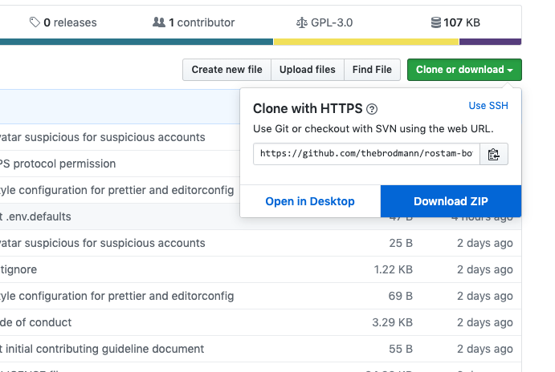
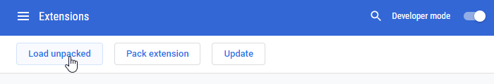

<h1 align="center">Rostam Bot</h1>

<h3 align="center">Browser extension that notify you suspicious accounts on Twitter</h3>

<p align="center">
  <a href="LICENSE">
    
  </a>
  <a href="https://github.com/semantic-release/semantic-release">
    
  </a>
  <a href="CONTRIBUTING.md">
    
  </a>
</p>

⚠️ **The extension is in beta state** ⚠️

Don't forget to star the repository to show your ❤️ and support.

If you wanna be a beta tester, you can follow the [installtion instruction](#install).
Do you found any bug with extension? well, please let us know by [opening an issue](https://github.com/thebrodmann/rostam-bot-extension/issues).

## Install

Prerequisites:

- [Node.js](https://nodejs.org/)
- [NPM](https://www.npmjs.com/) or [Yarn](https://yarnpkg.com/)

Grab a copy of the source code either by cloning the repository or by downloading and extracting the zipped source. You can download zip archive by opening the project page on GitHub and clicking on the "Download" button.



Install dependencies

```bash
# For NPM
npm install

# For Yarn
yarn install
```

Then you need to build the extension:

```bash
# For NPM
npm run build

# For Yarn
yarn run build
```

The command should exit with zero exit code and in the root of project the `dist` directory should be appeared.

### Google Chrome / Chromium

1. Open the Extension Management page by navigating to `chrome://extensions`.
2. Enable Developer Mode by clicking the toggle switch next to "Developer mode".
3. Click the "LOAD UNPACKED" button
4. Select the built extension's directory (the `dist/chrome` directory from root of the project).



### Firefox

1. Open Firefox
2. Enter `about:debugging` in the URL bar
3. Click the "Load Temporary Add-on" button
4. Open the built extension's directory (the `dist/firefox` directory from root of the project) and select any file inside the extension.

[](http://www.youtube.com/watch?v=cer9EUKegG4)

Ta-da! The extension has been installed. Now you can go to twitter and be integrated with [Rostam Bot](https://rostambot.com).

## Features

## Versioning

Rostam bot browser extension uses [Semantic Versioning 2.0.0](https://semver.org/).

## Contributing

Please read through our [contributing guidelines](CONTRIBUTING.md).

## 👏 Respect earns Respect

Please respect our [Code of Conduct](CODE_OF_CONDUCT.md), in short:

- Using welcoming and inclusive language
- Being respectful of differing viewpoints and experiences
- Gracefully accepting constructive criticism
- Focusing on what is best for the community
- Showing empathy towards other community members

## License

Rostam bot browser extension is released under [GPL-3.0.0 license](LICENSE).
